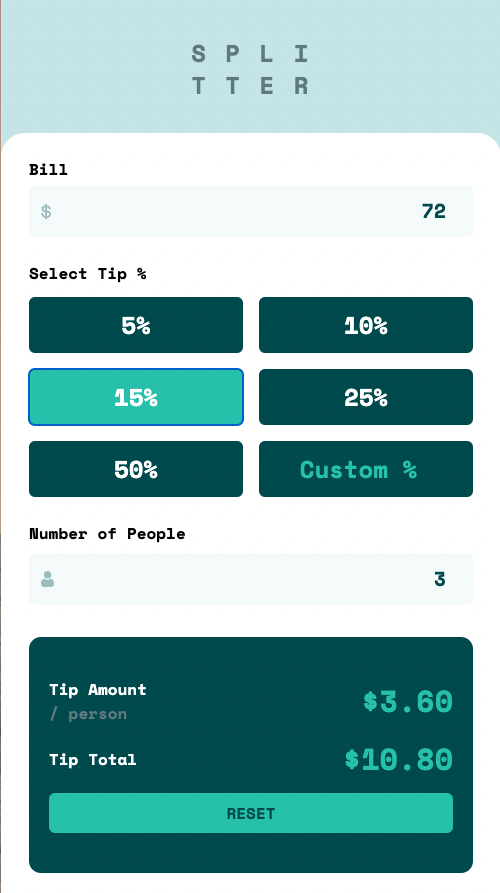
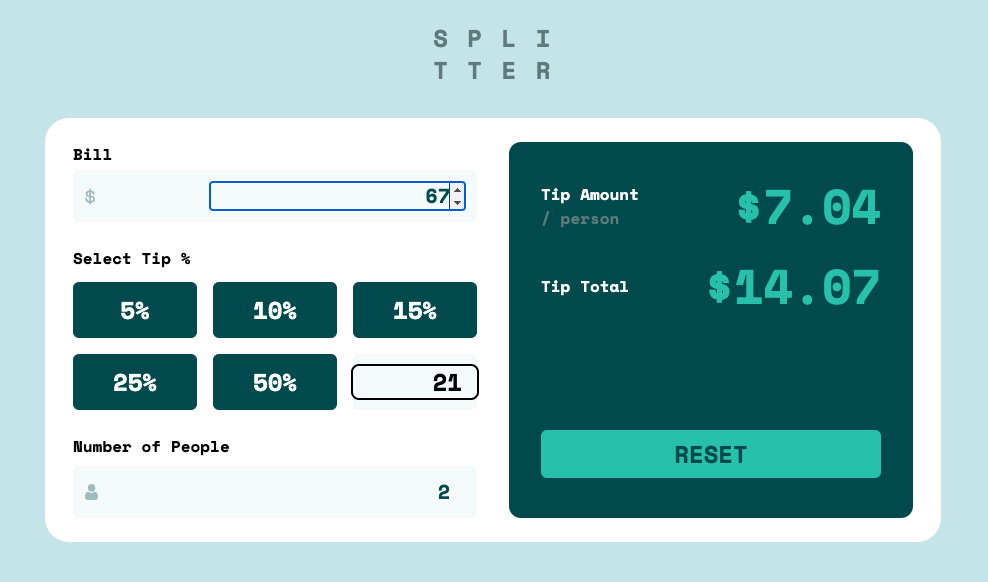
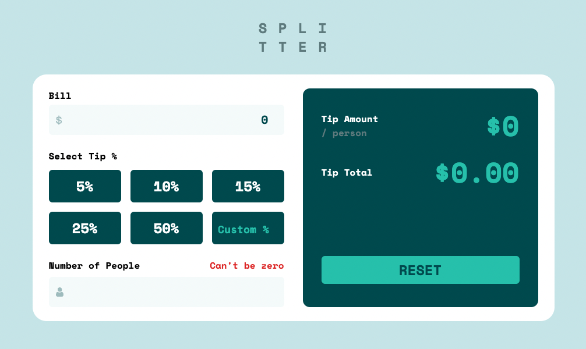

# Tip Calculator **S P L I T T E R**

another challange by [frontendmentor.io](http://frontendmentor.io)

written with **reactjs + tailwindCSS**
mobile first in mind, scaling for desktop

## input your bill and ...

-select your tip %

-input custom tip %

-select number of people to split your tip

## possible improvements/opportunities:

-refactor buttons as components for flexible usage

-tidy up some of the tailwind mess, too much lines of code for styling simple stuff

**anyways ... enjoy! :+1:**

